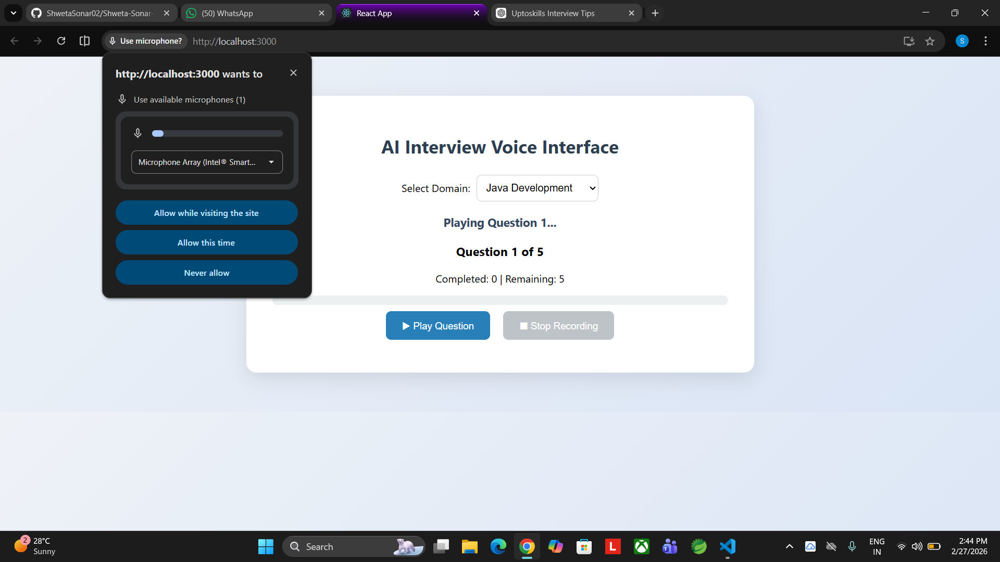
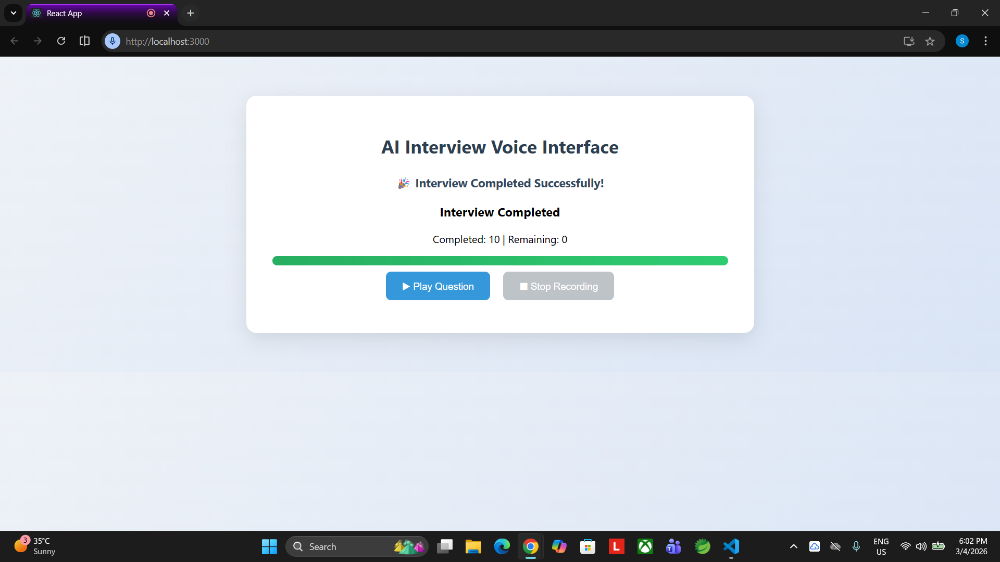

# AI-Based Interview Monitoring & Evaluation System

## 🎤 Frontend Voice Interview Interface

This module implements the **Frontend Voice Interaction Layer** of the AI-Based Interview System.

---

## 📌 Module Responsibility

This project focuses on:

* Domain Selection Interface
* Audio-Based Question Delivery
* Candidate Voice Recording
* Interview Progress Tracking

This module **does NOT include AI evaluation or backend processing**, as those are handled by other system components.

---

## ⚙️ Technologies Used

* React.js (Frontend Framework)
* JavaScript (MediaRecorder API)
* HTML5 / CSS3
* Browser Audio APIs

---

## 🎯 Features

### 1️⃣ Domain Selection

Candidates select their interview domain:

* Java Development
* Web Development
* AI / ML

---

### 2️⃣ Automated Question Playback

Each question is delivered as an audio file to simulate a real interviewer.

---

### 3️⃣ Candidate Voice Recording

Candidates record answers using their microphone.

---

### 4️⃣ Interview Progress Display

System shows:

* Current Question Number
* Completed vs Remaining Questions
* Visual Progress Bar
* Interview Completion Status

---

## 📂 Project Structure

```
public/audio/        → Interview Question Audio Files
src/App.js           → Interview Logic & UI
src/App.css          → Styling
src/DomainSelect.js  → Domain Selector
```

---

## 🚀 How to Run

```
npm install
npm start
```

Open in browser:

```
http://localhost:3000
```

---

## 📸 Application Screenshots

### 🔹 Domain Selection


### 🔹 Voice Question & Recording


### 🔹 Interview Progress Tracking


---

## 👩‍💻 Developed By

**Shweta Sonar**
MCA (2024–2026)
